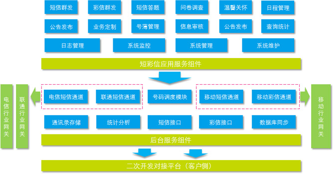

# 欢迎使用MAS信息机FAQ系统

## 产品定义

>**MAS**英文全称为 Mobile Agent Server（移动代理服务器），MAS应用目前较多的为MAS企业信息机，主要为企业提供包括短信、彩信功能在内的多种移动信息化服务。

**OpenMAS**企业信息机是依托移动公司提供的企业专属服务器，通过直连行业网关的方式，以短信、彩信、WAP等实现集团与员工、客户（或服务对象）之间的信息实时交互，满足企业内部办公、外部营销宣传的信息化产品。  

## 产品特点 
**OpenMAS**作为浙江移动融创公司最新推出的具备模块化结构、开放式接口的软件产品，与其他同类的MAS产品相比有明显的优势，其功能特点主要如下：  
- **多样的通讯录管理**：支持多种文件形式的数据导入方式，进行个人通讯录、企业通讯录、号码文件的灵活管理；  
- **丰富的短彩信应用** ：短/彩信群发、问卷调查、短信答题、日程提醒、公告发布、温馨关怀；  
- **方便的二次开发机制** ：提供多种二次开发策略，可以方便快速的将政企客户应用与企业信息机的短彩信应用相集成；  
- **完备的信息安全方案** ：通过短信验证码使用鉴权以及多种信息审核途径，提供完备的信息安全机制。  

## 产品介绍

<table>
  <thead>
	<tr>
	  <th width="30%" style="height: 40px;background-color: #ebf7ff;color: #0066b3;font-weight: bold;text-align: center;vertical-align: center;">&nbsp;</th>
	  <th width="35%" style="height: 40px;background-color: #ebf7ff;color: #0066b3;font-weight: bold;text-align: center;vertical-align: center;">适用企业</th>
	  <th width="35%" style="height: 40px;background-color: #ebf7ff;color: #0066b3;font-weight: bold;text-align: center;vertical-align: center;">服务内容</th>
	</tr>
  </thead>
  <tbody>
	<tr>
	  <th style="height: 110px;background-color: #ebf7ff;color: #0066b3;font-weight: bold;text-align: center;vertical-align: middle;">OpenMAS高端机</th>
	  <td style="background-color: #ebf7ff;vertical-align: middle;font-size: 12px;">
发送需求量大（短信日发送数量大于100万条），或有移动、电信、联通行业端口直发需求的政府及企业客户。
</td>
	  <td style="background-color: #ebf7ff;vertical-align: middle;font-size: 12px;">
		<ul>
		  <li>提供设备及软件部署</li>
		  <li>实现移动/电信/联通三网短信协议、分级管理、大数据量发送等短彩信群发应用及二次开发接口</li>
		</ul>
	  </td>
	</tr>
	<tr>
	  <th style="height: 110px;background-color: #ebf7ff;color: #0066b3;font-weight: bold;text-align: center;vertical-align: middle;">OpenMAS多用户版</th>
	  <td style="background-color: #ebf7ff;vertical-align: middle;font-size: 12px;">
短信日发送量低于100万条且无设备内网对接需求的政府及企业客户。
</td>
	  <td style="background-color: #ebf7ff;vertical-align: middle;font-size: 12px;">
		<ul>
		  <li>设备托管在移动机房侧</li>
		  <li>基于移动短信协议提供短彩信群发应用及二次开发接口</li>
		</ul>
	  </td>
	</tr>
	<tr>
	  <th style="height: 110px;background-color: #ebf7ff;color: #0066b3;font-weight: bold;text-align: center;vertical-align: middle;">OpenMAS单机版</th>
	  <td style="background-color: #ebf7ff;vertical-align: middle;font-size: 12px;">
短信日发送量低于100万条且存在设备内网对接需求的政府及企业客户。
</td>
	  <td style="background-color: #ebf7ff;vertical-align: middle;font-size: 12px;">
		<ul>
		  <li>提供设备及软件部署</li>
		  <li>基于移动短信协议提供短彩信群发应用及二次开发接口</li>
		</ul>
	  </td>
	</tr>
  </tbody>
</table>

## 产品功能

## 产品性能

<table style="background-color: #ebf7ff;">
  <thead style="background-color: #ebf7ff;vertical-align: middle;font-size: 15px;">
	<tr>
	  <th colspan="2">产品性能</th>
	  <th>OpenMAS高端机</th>
	  <th>OpenMAS多用户版</th>
	  <th>OpenMAS单机版</th>
	</tr>
  </thead>
  <tbody style="background-color: #ebf7ff;vertical-align: middle;font-size: 14px;">
	<tr>
	  <th rowspan="5">短信</th>
	  <td><h5>最高发送速率</h5></td>
	  <td>180条/秒</td>
	  <td colspan="2">60条/秒</td>
	</tr>
	<tr>
	  <td><h5>每日发送限额</h5></td>
	  <td>400万条</td>
	  <td colspan="2">100万条</td>
	</tr>
	<tr>
	  <td><h5>每月发送限额</h5></td>
	  <td>无</td>
	  <td colspan="2">300万</td>
	</tr>
	<tr>
	  <td><h5>web单次提交限额</h5></td>
	  <td>10万条</td>
	  <td colspan="2">10万条</td>
	</tr>
	<tr>
	  <td><h5>二次开发单次提交限额</h5></td>
	  <td>10万条</td>
	  <td colspan="2">5万条</td>
	</tr>
	<tr>
	  <th rowspan="5">彩信</th>
	  <td><h5>最高发送速率</h5></td>
	  <td>5条/秒</td>
	  <td colspan="2">2条/秒</td>
	</tr>
	<tr>
	  <td><h5>每日发送限额</h5></td>
	  <td>10万条</td>
	  <td colspan="2">1万条</td>
	</tr>
	<tr>
	  <td><h5>每月发送限额</h5></td>
	  <td>50万</td>
	  <td colspan="2">10万</td>
	</tr>
	<tr>
	  <td><h5>web单次提交限额</h5></td>
	  <td>1万条</td>
	  <td colspan="2">0.5万条</td>
	</tr>
	<tr>
	  <td><h5>二次开发单次提交限额</h5></td>
	  <td>1万条</td>
	  <td colspan="2">0.5万条</td>
	</tr>
	<tr>
	  <th width="10%" rowspan="2">通讯录</th>
	  <td width="24%"><h5>通讯录一次导入条数</h5></td>
	  <td colspan="3">1万</td>
	</tr>
	<tr>
	  <td><h5>号码文件一次导入条数</h5></td>
	  <td colspan="3">10万</td>
	</tr>
	<tr>
	  <th width="10%" rowspan="2">其他</th>
	  <td width="24%"><h5>硬件设备</h5></td>
	  <td width="22%">硬件设备</td>
	  <td width="22%">多企业共享</td>
	  <td width="22%">单独</td>
	</tr>
	<tr>
	  <td><h5>网络环境</h5></td>
	  <td>公网或内网</td>
	  <td>公网</td>
	  <td>内网</td>
	</tr>
  </tbody>
</table>

## 服务热线

- 客服热线：400-10086-11

- 客服邮箱：<mas400@139.com>

