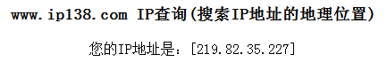

# 2.3 IP地址绑定错误
	
**问题现象一（`单机版`）**：在OpenMAS业务申办的过程中时,如果OpenMAS服务器预计安装在客户侧机房，客户经理就需要在业务系统中登记绑定客户的公网IP地址，但是经常出现客户提供的公网IP地址参数与实际不符，或者客户不知道自己使用的公网IP是多少。    

**解决方法**： 针对此类情况，建议在客户网络环境中的电脑上（最好是直接在OpenMas服务器 上）登陆网址`www.ip138.com`，网页中显示的IP地址即为客户的公网IP地址，如下图所示：    
  

 
--------------------------
**问题现象二（`多用户版`）**：多用户版OpenMAS业务申办的过程中时，不能预计该用户安装于哪台OpenMAS服务器，客户经理就需要在多用户版OpenMas信息机安装完成后，根据工程师反馈的服务器IP去重新改绑。  

**解决方法**：及时查收开通反馈邮件，按邮件正文提示在网关绑定信息机IP。    

**问题现象三（`云化版`）**：OpenMAS云化版是多用户版的升级版，开通云化版存在同样的上述问题。  

**解决方法**：OpenMAS云化版统一部署在云资源池，IP固定不变：`主：112.13.167.253；备：112.13.167.254`，开OpenMAS云化版可预先绑定此IP。    

