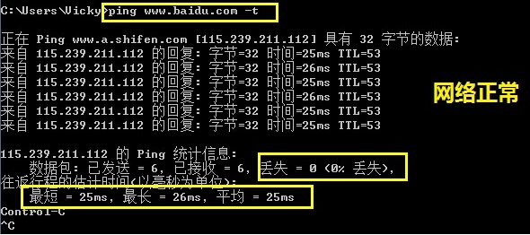
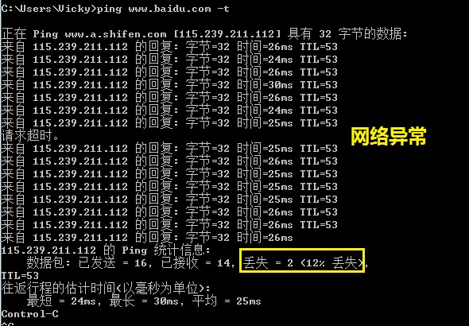
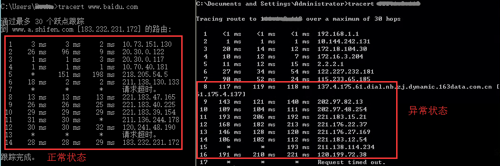

# 2.5 其它问题

**问题现象一**:登录页面打不开（不是页面报错哦）。

**解决办法**:  
（1）检查访问网址是否输入正确:  
* 多用户版:统一域名登录网址为"www.openmas.net" （金华:www.jhmcc.com）,  
Ip方式:http://公网IP:端口；  
		易错点:“http”写成“https”； 
		
* 单机版:Ip方式:http://IP:端口；  
		易错点:与多用户版弄混,输错IP；
		单机版IP可能是公网（托管在机房）,也可能是局域网（服务器安装在客户侧）；
		端口可能默认是80（默认不用输入）,也可能安全整改过,为指定的端口。
			
* 高端机:同单机版；

（2）检查网络通信是否正常:

a)**使用Ping检查网络**:进入DOS命令提示符,输入`Ping IP地址（网址） -t` 回车(命令和目标地址和参数之间是有空格的,需预先关闭系统防火墙),约1分钟后,按Ctrl+C结束,根据最大数据、最小数据、平均数据以及丢包率来判断本地网络是否正常。  
	正常状态:最短、最长、平均数据相差不大,无丢包率  
	异常状态:最短、最长、平均数据相差较大,大多伴随有丢包率  

>**小贴士**:如何进入DOS  
>* XP系统: 电脑左下角开始>>运行>>输入cmd>>回车>>输入ping www.baidu.com -t>>回车  
>* Win7系统:电脑左下角开始>>搜索框输入cmd>>回车>>输入ping www.baidu.com -t>>回车  
>* Win8.1系统:电脑左下角空白处>>鼠标右键>>命令提示符>>输入ping www.baidu.com -t>>回车  
>* Win10系统:电脑左下角菜单>>运行>>输入cmd>>回车>>输入ping www.baidu.com -t>>回车  
	
b)**使用tcping检查网络**:跟Ping类似,但是这个不会被防火墙拦截,下载tcping.exe,放在C:\WINDOWS\system32 目录下,进入DOS命令提示符,输入命令即可使用,状态查询同上。
	
>**小贴士**:常用命令:  
>* tcping /?  【查询的命令】   
>* tcping www.baidu.com   
>* tcping -t www.baidu.com 【参数-t 是让命令一直运行ping 】   
>* tcping -d -t www.baidu.com 【参数 -d 是显示时间,这样就可以更清楚了】   
>* tcping -d -t www.baidu.com 21 【这里只是举例,21是您所需要监听的端口,这个可以行定义。】   
	
c)**通过tracert检查网络骨干节点是否正常**:进入DOS命令提示符,输入`tracert+目标地址+参数`,例如输入`tracert baidu.com -d`,如下图:  

				
左图是一个比较正常的延迟;
右图是不正常的,第7到第8延迟从52ms上升到119ms,这是典型的骨干节点出问题造成的
接下来延迟又从第9跳的111上升到第10跳的402,也是骨干网的事。  
去www.ip138.com查下这两个ip地址,得到的数据如下:全国电信骨干网和电信上海市出口.
中国总共就三个大的出口:北京,上海,广州.骨干出问题了,谁也没有办法,一般像这样的骨干网络问题会在2小时左右恢复。  
		
>**小贴士**:常用命令:
>* tracert baidu.com -d 【(-d是不解析域名)(命令和目标地址和参数之间是有空格的)】

----------------------------------	
>**PS**:带宽是带宽,延迟是延迟,两者是完全不同的概念；只有本地网络正常....    
>带宽是指本机接入互联网的带宽（单位Mb）,可以理解为最大下载速度.  
>延迟则通常指本机到指定ip的响应速度（单位Ms）,可以理解为是打开网页的速度.  
