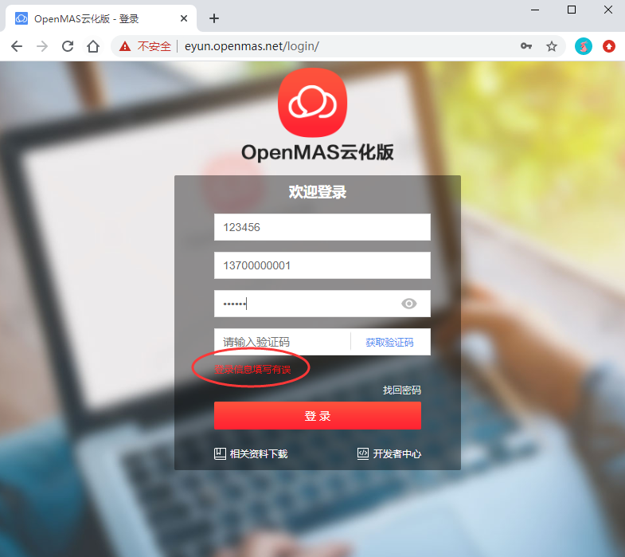

# 4.1 登录信息错误 

**问题现象**：登录页面，输入集团业务号、手机号码、密码、验证码，点击【获取验证码】时提示“登录信息错误”或“填写信息错误”。

**原因**：  
（1）集团业务号输入错误；  
（2）用户名输入错误；  
（3）密码输入错误。

**解决办法**：
（1）确认集团业务号是否正确，集团业务号，就是企业标识：为接入号的后6位，不足6位的，前用“M”补齐，比如“M95123”；    
（2）手机号码就是账户；  
（3）密码输入错误？请使用“找回密码”功能，自助找回密码。    

