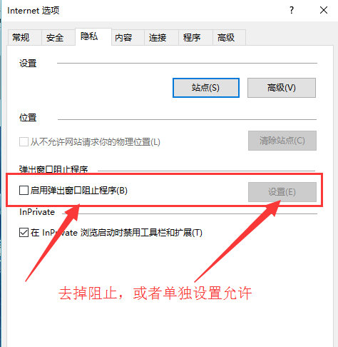
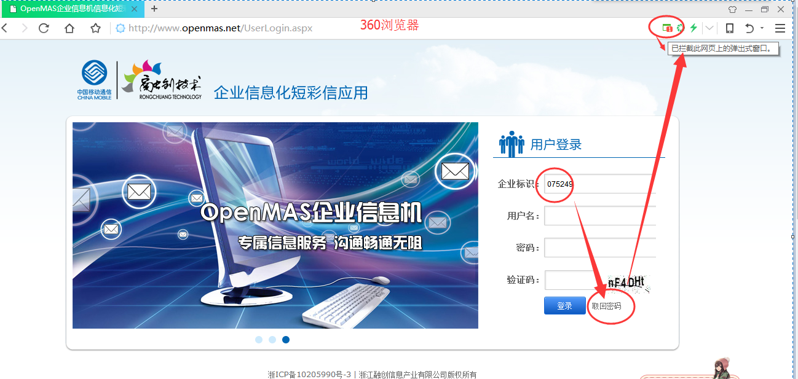

# 4.3 找回密码提示“信息输入错误”

**问题现象**：登录页面（www.openmas.net），输入企业标识后点击【取回密码】链接，提示“企业标识不存在”。

**原因**：  
（1）企业标识输入错误，或用户不是多用户版用户；   
（2）浏览器或杀毒软件阻止了【取回密码】弹出窗口；  

**解决办法**:关闭杀毒软件或其它安全软件，并将浏览器设置为允许弹出窗口，推荐使用IE浏览器（Internet Explorer）,。  

>**小贴士**：IE、360、搜狗浏览器设置方式如下（仅供参考，不同版本设置方式可能存在差异，如有不同请自行查阅浏览器的官网或百度查询）：

**IE浏览器允许弹窗设置**：

**360浏览器允许弹窗设置**：

**Sogou浏览器允许弹窗设置**：

