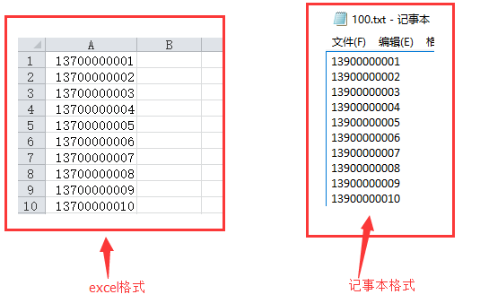
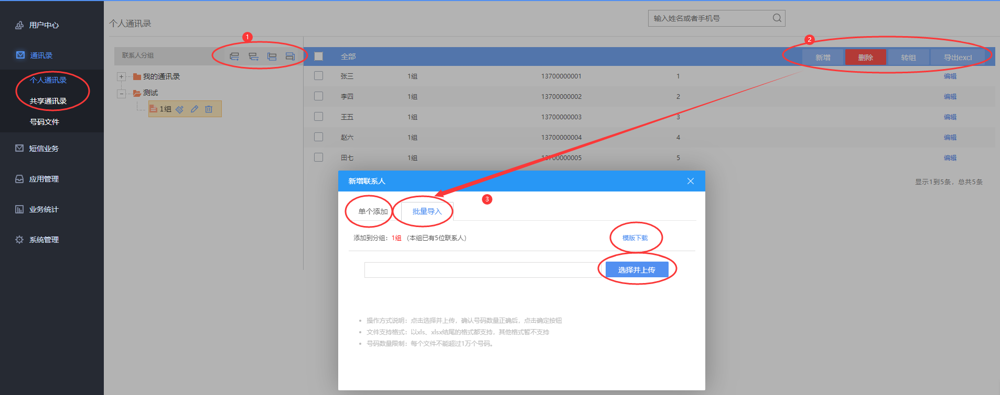
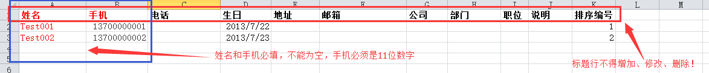

# 4.6 号码文件和通讯录

**号码文件**：推荐使用（特别是群发量大的），原因如下：
号码文件可以使用txt记事本或excel文件进行编辑、保存和导入，只需要按格式编辑一列，使用简单，易于编辑整理，模板格式如下：   
>**小贴士**：云化版只支持txt记事本格式 ，单次最多5万个号码，无需列名.  

   

**个人通讯录**：只有当前登陆用户可使用该通讯录（非共享）；

**共享通讯录**：系统下建立的子用户也可以使用该通讯录，通讯录联系人将被共享。

**界面主要操作示意如**：
  

**通讯录**：采用Excel文件进行编辑、保存和导入，虽然管理记录的信息量大，但也造成操作较复杂，对使用者的计算机使用水平要求较高，而且服务器对于通讯录的读取反应速度也因数据量大而慢于号码文件，模板如下：    
   

**基于上述原因，如果使用者只是对大量手机号码进行粗放型的批量发送，建议使用号码文件的方式进行号码管理**；而如果使用者需要对某些人员、手机号进行精细化管理，有针对性的发送不同的短信内容，例如公司内部的各个部门、小组、同事，则建议使用通讯录的方式进行管理。