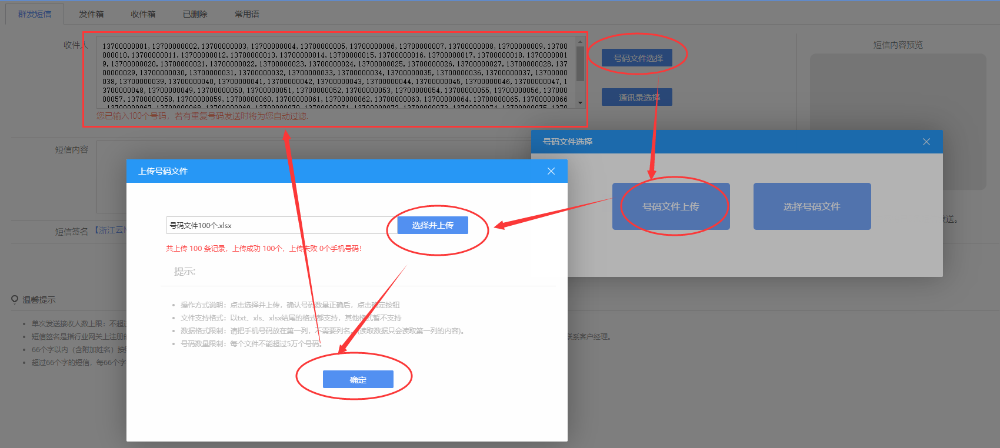
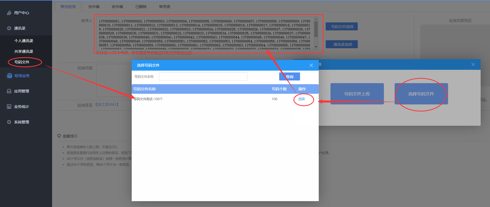
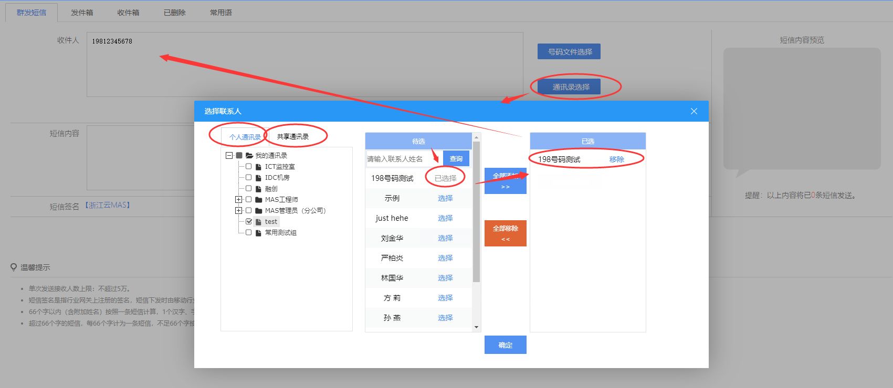

# 4.7 如何群发短信

### 一、通过号码文件群发短信  
`（只需上传号码文件--txt记事本编辑一列手机号码） `    
1.【短信业务】->【群发短信】->【号码文件选择】：  
（1）点击【号码文件上传】->【选择并上传】，选择提前编辑好的号码文件，然后【确定】直接完成号码上传；  
  

（2）或点击【选择号码文件】->从号码文件列表中【选择】所需的号码文件  
>注意：需提前在【通讯录】->【号码文件】上传号码文件；   

  

2.书写短信内容，点击【确认并提交】，发出短信。  

### 二、通过个人通讯录选取发送对象  
**涉及“通讯录”、“短信业务”两个大模块**：  
1.【短信业务】->【群发短信】->【通讯录选择】，弹出选择联系人的页面，选择【个人通讯录】或【共享通讯录】，如下图示意；  
2.书写短信内容，并点击【发送】，发出短信。

   

> **小贴士**： 个人通讯录&共享通讯录  
> `选择通讯录，需要先建立通讯录，通讯录支撑批量导入.`  
> **个人通讯录**：只有当前登陆用户可使用该通讯录（非共享）；  
> **共享通讯录**：系统下建立的子用户也可以使用该通讯录，通讯录联系人将被共享；