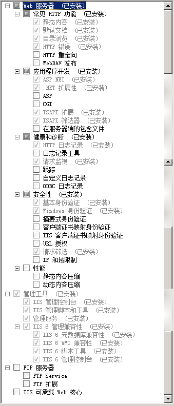
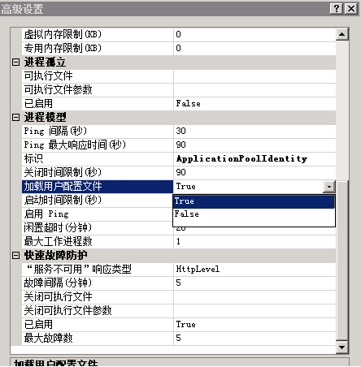

 5.1 安装部署中常见问题 

**1.A**:创建数据库为什么失败？    
**Q**:检查数据实例名称是否选择正确，注意区分是否sqlexpress版本，如下图： 
    

------------
**2.A**:更新数据库，提示错误,错误信息如下图所示： 
  
**Q**: 自动清理OpenMas数据库时，会生成一张临时表TempDataRemove，清理成功后该表自动删除；如果清理超时或清理失败，该表自动删除失败，更新数据库就会报错。手工删除TempDataRemove表，重新执行更新数据库即可。  

------------
**3.A**:创建用户，提示系统故障信息“工作站服务没有启动”   
  
**Q**:右击我的电脑--管理--服务和应用程序--服务--“Workstation”--右键--启动，OK。   

------------
**4.A**:创建用户，提示系统故障信息“没有启动服务器服务”  ，具体错误信息如下：
```
错误描述：异常来自 HRESULT:0x80070842  
在System.OpenMas.Installer.Form1.CreateUserAccount(String userAccount, String password)  
在 System.OpenMas.Installer.Form1.btnCreatePortal_Click(Object sender, EventArgs e)  
```
**Q**:右击我的电脑--管理--服务和应用程序--服务--“Computer Browser”--右键--启动,OK。   

------------
**5.A**:安装门户失败  
**Q**:IIS未安装完整，请检查安装项，按下图选项安装接口。  
 

------------
**6.A**:IIS安装配置项没问题IIS安装配置项没问题，web网页为什么打不开，显示页面异常？  
**Q**:发布的web站点可能被个人修改过了，比如自定义了主机头（如下图），删除自定义的主机头即可。另外不明问题，建议删除站点直接重新安装。    
 

------------
**7.A**: 应用程序中的服务器错，系统找不到指定的文件，CryptographicException...  
   
**Q**:IIS配置问题，未加载用户配置文件，如下加载下即可，如下方式还不能解决问题，那就可能是RSA加密解密存在问题，需将错误信息机处理方式写明转研发优化处理。      
   
