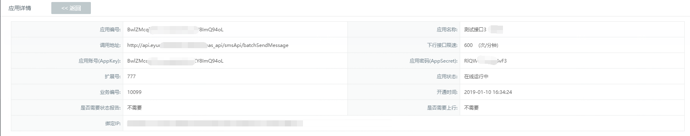

# 如何开通和获取接口信息

### 一、如何申请开通接口

**接口开通流程**：  

1.客户侧技术开发阅读[开发者中心](http://eyun.openmas.net/yunmas_biz/DeveloperCenter/)，`确认接口类型`；  

2.客户经理协助填写[接口开通申请表](../download/【附件1】OpenMas信息机开户申请表.xlsx),按表格填写说明填写并`提交申请表`，收到申请后1个工作日内开通。

### 二、如何查看已开通的接口信息  

**操作步骤**：  
1.系统管理员登录 eyun.openmas.net 云化版信息机平台，点击【应用管理】→【应用列表】→查看开通的接口列表，如下图所示：     
 

2.按应用名称（一般为接口申请开通时用户登记需要接入的系统简称）找到新开的接口，点击【查看】， 如下图所示：   
 

>**小贴士**：  
>仔细开发者中心每一项参数说明，特别注意：  
>* `requestTime` 时间差不能超过5分钟；   
>* `sign` 生成规则：MD5Util.MD5(applicationId+password+requestTime+sign令牌)   
>* `funCode`服务代码，群发短信为1002   
