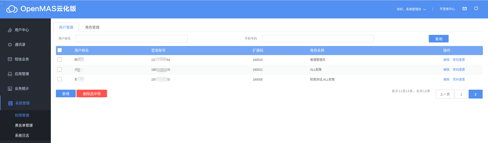
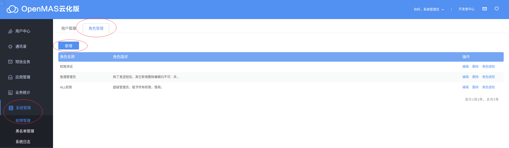
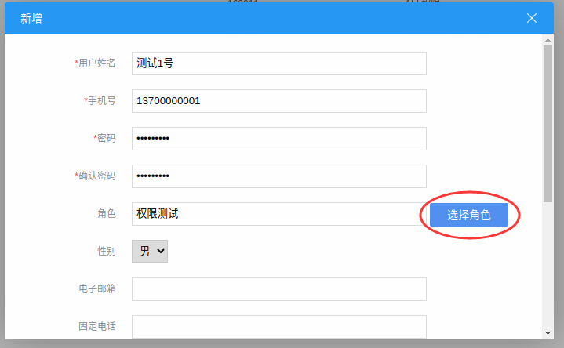
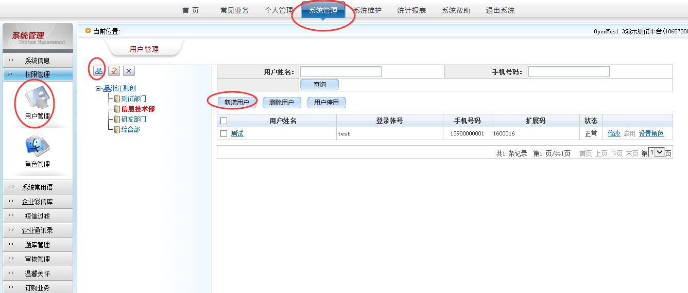
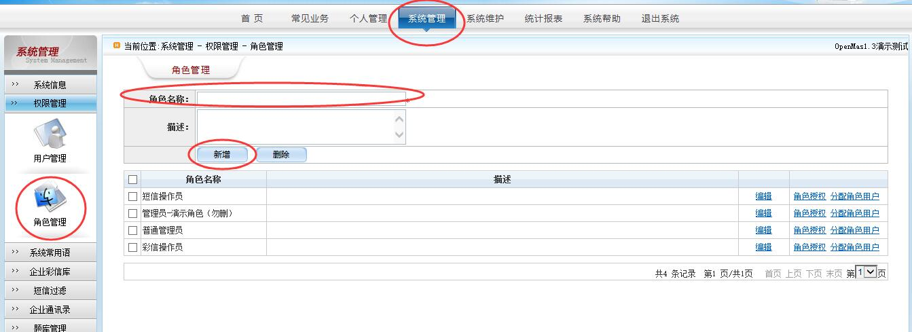
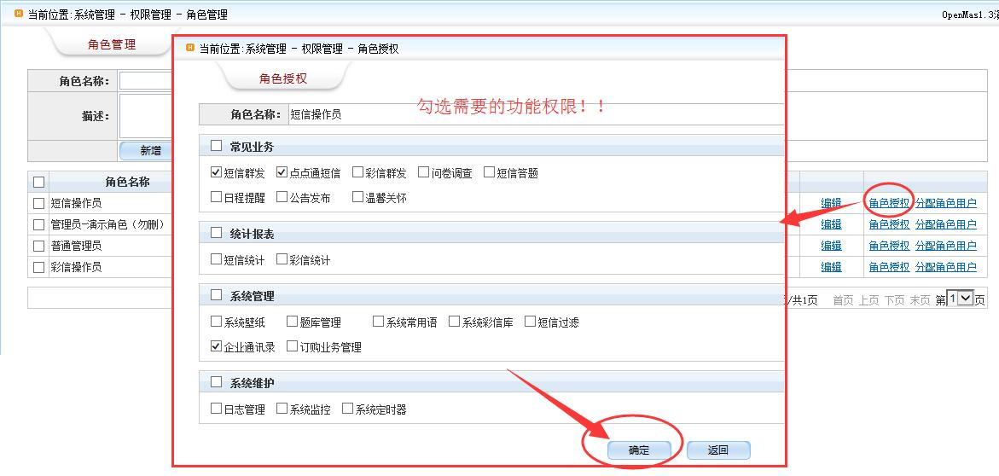
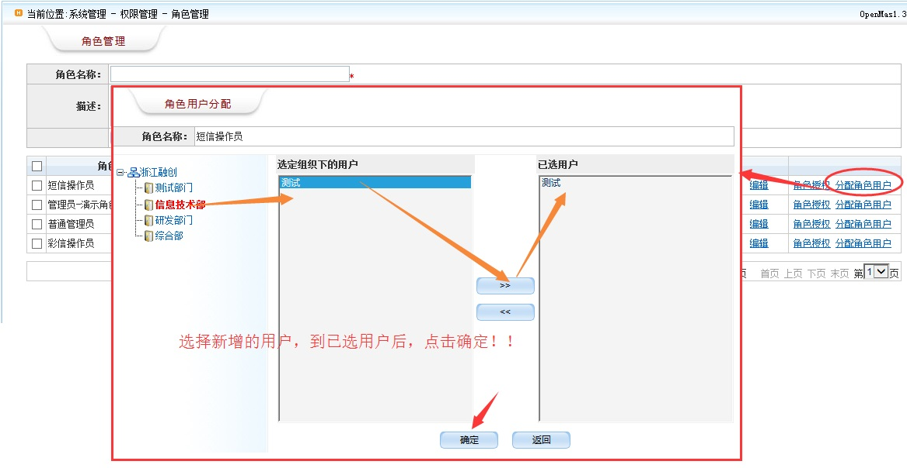

# 如何添加子账号

**操作步骤（OpenMas云化版）**：  
本操作较为复杂，主要涉及四个操作过程：添加用户（子账号）、添加角色、给角色赋权、给用户赋予角色。  
1.添加角色：【系统管理】→【权限管理】→【角色管理】→【新增】：输入角色信息，点击【确认】；  

2.给角色赋权：【系统管理】→【权限管理】→【角色管理】→【角色授权】：选择该角色需要的功能权限，点击“确定”，OK；  
 

3..添加用户：【系统管理】→【权限管理】→【用户管理】→【新增】：输入用户信息，选择角色，点击【确认】;  
 

 

---
**操作步骤（OpenMas1.2/1.3/2.0）**：  
本操作较为复杂，主要涉及四个操作过程：添加用户（子账号）、添加角色、给角色赋权、给用户赋予角色。  
1.添加用户：【系统管理】→【权限管理】→【用户管理】：  
（1）添加组织结构（部门群组）；  
（2）选择群组，点击“新增用户”，按填写说明，填写完毕后确认提交，OK； 
如图所示：  
 

2.添加角色：【系统管理】→【权限管理】→【角色管理】：输入角色信息，点击“新增”，OK；  
 

3.给角色赋权：【系统管理】→【权限管理】→【角色管理】→【角色授权】：选择该角色需要的功能权限，点击“确定”，OK；  
 

4.给用户赋角：【系统管理】→【权限管理】→【角色管理】→【分配角色用户】：选择群组→ “选定组织下的用户”框下选择用户，点击 按钮，将其移到“已选用户”框中，点击“确认”，OK。
 
 
5.退出系统，用新账号登陆测试。
