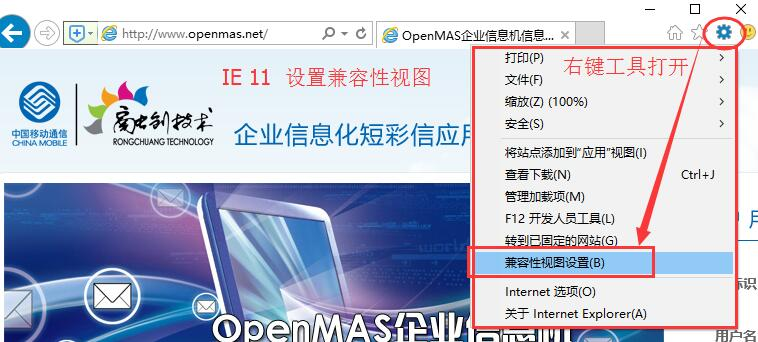
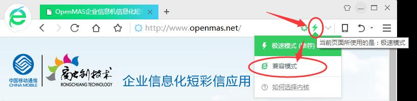

# 浏览器兼容性设置

**问题现象**:登录OpenMas信息机默认web平台后，点击任何菜单或按钮没有反映。

**问题原因**：浏览器兼容问题导致（IE10最为严重），设置兼容模式即可。推荐使用IE浏览器(Internet Explorer)。

**IE11浏览器兼容性视图设置方式**：  

**360浏览器兼容性视图设置方式**：  

**Sogou浏览器兼容性视图设置方式**：  
