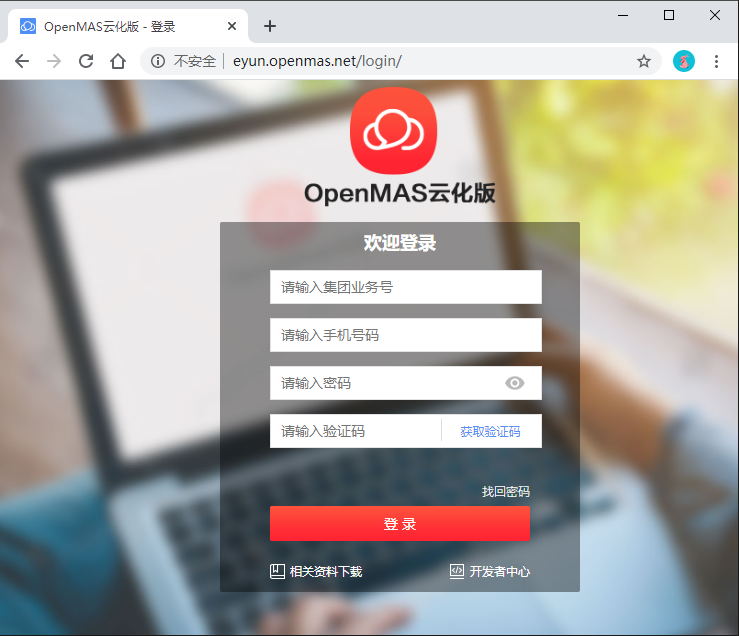

# 什么是云化版

>**云化版**：OpenMas云化版，是OpenMas多用户版的升级版，取消了原OpenMas多用户版产品搭配服务器硬件的方式，统一部署在云资源池，各地市将无需派驻工程师。    
   * 统一登录地址：http://eyun.openmas.net
   * 无需安装硬件服务器，软件应用统一部署在省网管资源池；  
   * 基于移动短信协议提供短信群发应用及模板短信二次开发接口。  
   

