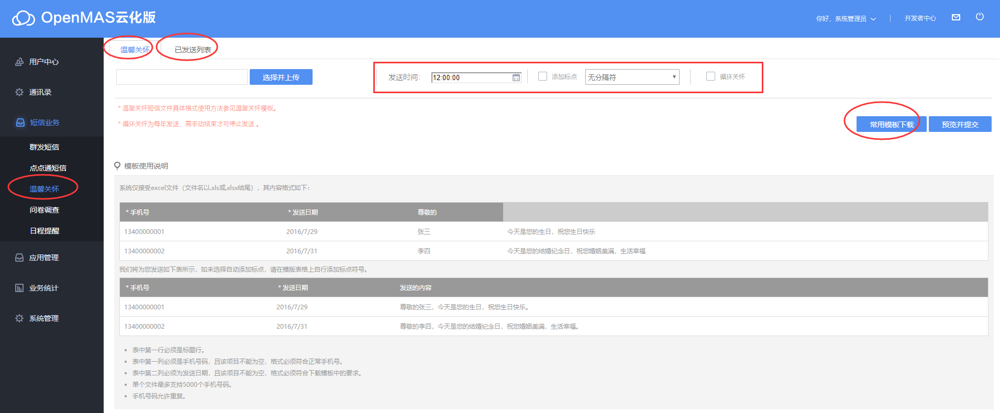

# 如何发送温馨关怀

**操作步骤**:  

1.进入【短信业务】->【温馨关怀】->下载【常用模版】，按模版编辑关怀文件;  
2.点击【选择并上传】，选择编辑完成的关怀文件，并点击【预览并提交】，发出点点通短信。  

**界面主要操作示意如**：
  

>**小贴士**：
>单个文件最多支持5000个手机号码,手机号码不能为空；  
>循环发送，为每年发送，需要再发送之前勾选，需手动结束才可停止发送 。