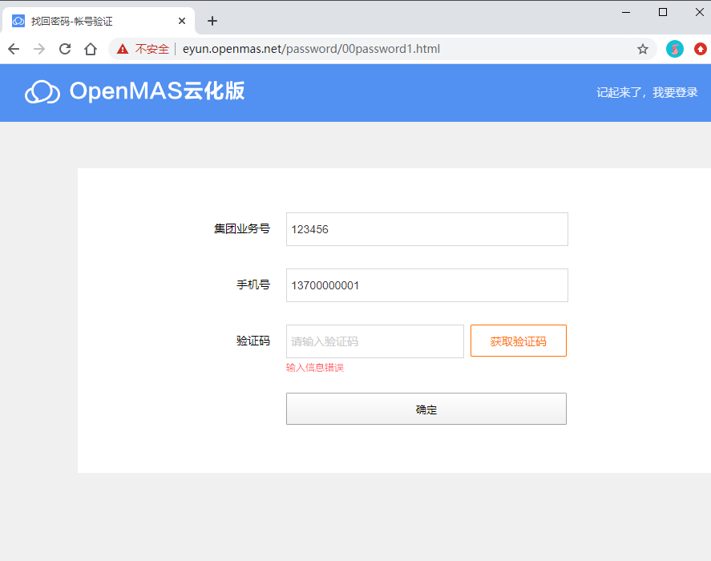

# 如何找回密码

**问题现象**：忘记密码或者密码过期。

**解决办法**:登陆页面自助找回密码，步骤如下：    
（1）打开云化版信息机登陆页面，【找回密码】，打开找回密码页面,如下截图；  
（2）输入“集团业务号”、“手机号码”，点击【获取验证码】，   
* 如果点击【获取验证码】提示“输入信息错误”，则说明您的业务或账户（手机号码）不存在，可能不是信息机用户，请联系客户经理确认信息机业务是否存在；    
* 如果点击【获取验证码】 提示“验证码发送成功”，则输入手机收到的验证码，点击【确定】，手机即可收到新的初始化密码。  

>**小贴士**：
>* 用户手机号码需是`浙江省`内`移动`手机号码.

