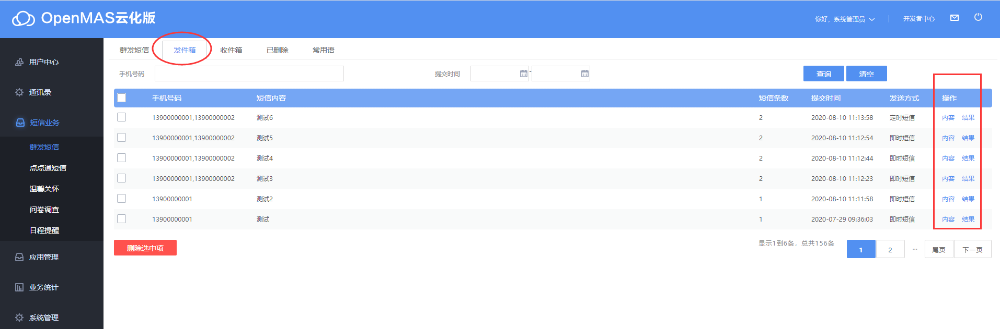
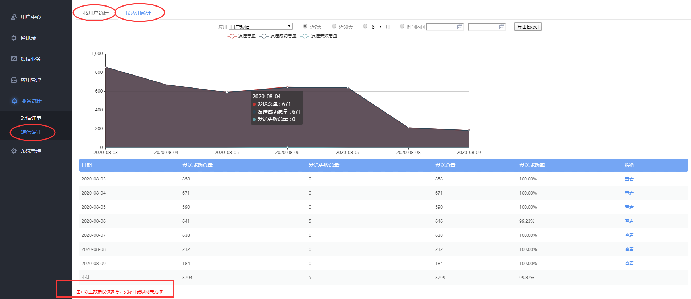

# 如何查询发送记录和统计

### 一、查询发送记录：登录eyun.openmas.net云化版
**方式一**：找到【短信业务】→【群发短信】→【发件箱】，即可查看所有的发送记录。再点击【结果】，可查看这一批次的详细发送结果。  

**方式二**：找到【业务统计】→【短信详单】，即可查看所有的发送记录，注意如果是子账户登录查看的话，需要管理员预先赋予权限。

>**小贴士**：发送记录，云化版平台仅提供最近3个月的。

### 二、查询统计
查询统计：找到【业务统计】→【短信统计】→选择【按用户统计】或按【按应用统计】，即可查看统计，默认显示最近7天的统计：
>**小贴士**：
> * 按用户统计：按天统计云化版默认web平台各账户发送条数；  
> * 按应用统计：统计各接口发送条数；  

