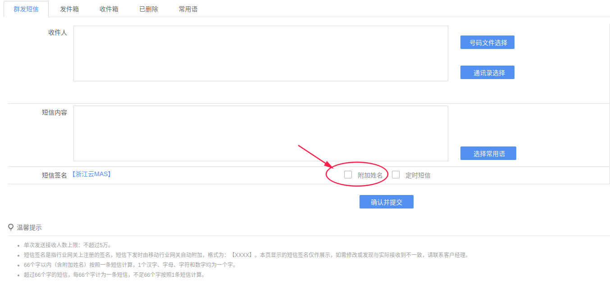

# 如何附加姓名

**操作步骤（OpenMas1.2/1.3/2.0）**：  
1.【常见业务】→【短信发送】→选中“附加姓名”，点击【发送】，该条短信的首部或尾部将显示登陆用户的姓名（是姓名哦(*╹▽╹*)不是用户名哦^_^）。

2.Admin账号有权强制所有子账号附加姓名：【系统管理】→【功能管理】→【功能配置】→【其它参数配置】，配置“强制签名”项；
  
3.Admin账号可通过【系统管理】→【权限管理】→【用户管理】→修改用户姓名，修改其附加姓名内容。  

---
**操作步骤（OpenMas云化版）**： 
1.【短信业务】→【群发短信】→勾选“附加姓名”，点击【发送】，该条短信的尾部将显示登陆用户的姓名（是姓名哦(*╹▽╹*)不是用户名哦^_^）。 
