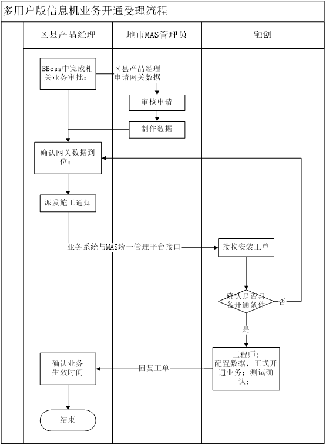

# 如何开通 MAS 信息机

### 一、如何申请开通企业信息机（MAS 信息机）

**（一）单机版开通流程**：`单机版已停产`  
1.ESOP 系统中完成相关业务审批后，区县产品经理在 ESOP 系统中派 SI 施工，并向地市 MAS 管理员申请网关数据；  
2.区县产品经理同时联系客户确认是否具备安装条件；  
3.如网关数据到位，且具备相关安装条件，浙江移动区县产品经理向浙移集成派发施工工单；

> 工单方式：通过 OA 邮箱发送信息机开通申请至mas400@139.com；  
> 开通申请表下载： [OpenMas 信息机开通申请表](../download/【附件1】OpenMas信息机开户申请表.xlsx)

4.浙移集成服务经理确认安装条件后，调度工程师上门安装；如到现场发现安装条件仍不具备，则在《客户满意度反馈表》中做好记录，请客户签字确认，并返回区县产品经理重新跟进确认现场安装条件；  
5.如融创工程师现场确认具备安装条件，则完成安装调试，请客户在《客户满意度反馈表》签字确认；  
6.融创工程师回单，通知区县产品经理完成安装工单，流程结束。

**（二）多用户版开通流程**：`多用户版已停产`

**云化版开通流程(同多用户版)**：

1.ESOP 系统中完成相关业务审批后，区县产品经理在 ESOP 系统中派 SI 施工，并向地市 MAS 管理员申请网关数据；  
2.如网关数据到位，地市 MAS 管理员、区县产品经理向浙移集成派发开通工单；

> 工单方式：通过 OA 邮箱发送信息机开通申请至mas400@139.com,收到申请后 1 个工作日内开通；  
> 开通申请表下载： [OpenMas 信息机开通申请表](../download/【附件1】OpenMas信息机开户申请表.xlsx)  
> 3.浙移集成服务经理确认开通条件后，调度工程师进行开通；  
> 4.融创工程师进行多用户版业务开通和测试；  
> 6.融创工程师回单，通知区县产品经理完成开通工单，流程结束。

